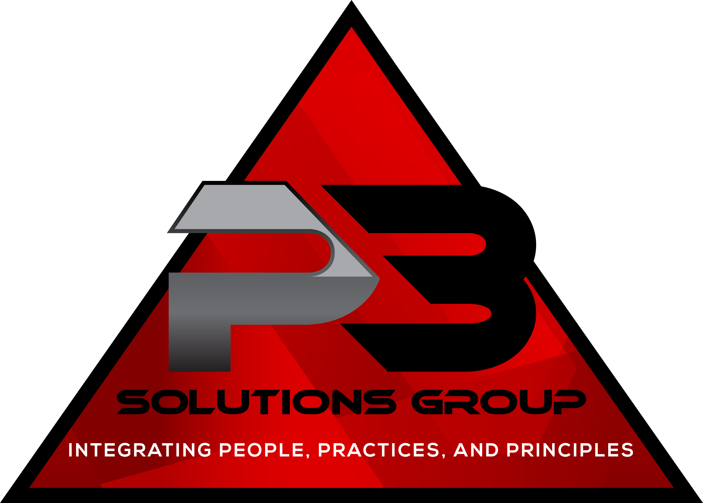

# P3 Solutions Group Corporate Website

<div align="center">
  
</div>

## Overview

This repository contains the source code for the official **P3 Solutions Group** corporate website.  
Built using **Vite 5.4.2** and **React 18.3.1**, the site is optimized for performance, scalability, and maintainability.

**P3 Solutions Group** — _Integrating People, Practices, and Principles._

---

## Features

- ⚡ **Fast Development**: Powered by Vite for lightning-fast hot module replacement (HMR) and build times.
- 🎨 **Modern UI**: Built with React 18.3.1 and styled for a professional corporate look.
- 📱 **Responsive Design**: Fully responsive layout for desktop, tablet, and mobile.
- ♿ **Accessibility First**: Designed with WCAG 2.1 AA compliance in mind.
- 🔍 **SEO Optimized**: Meta tags, Open Graph, and structured data included for search visibility.
- 📂 **Modular Codebase**: Reusable components for easier maintenance.

---

## Tech Stack

- **Frontend Framework**: [React 18.3.1](https://react.dev/)
- **Build Tool**: [Vite 5.4.2](https://vitejs.dev/)
- **Styling**: CSS Modules / Tailwind CSS (update based on your setup)
- **Deployment**: (e.g., Netlify, Vercel, AWS Amplify — specify your deployment target)
- **Version Control**: Git + GitHub

---

## Getting Started

### Prerequisites

Make sure you have the following installed:

- [Node.js](https://nodejs.org/) (version 18+ recommended)
- npm or yarn (latest stable)

### Installation

```bash
# Clone the repository
git clone https://github.com/your-org/p3-solutions-group.git
cd p3-solutions-group

# Install dependencies
npm install
# or
yarn install
```
